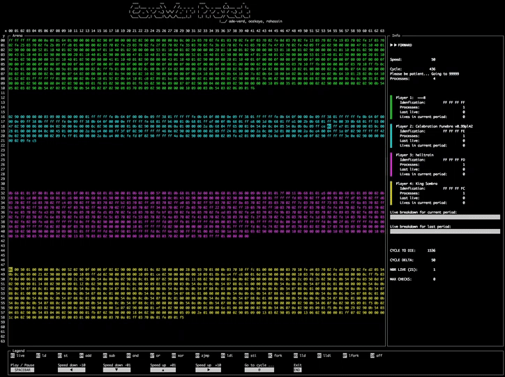
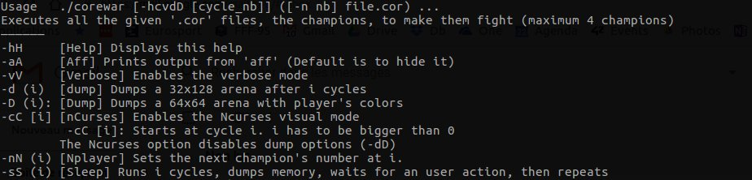
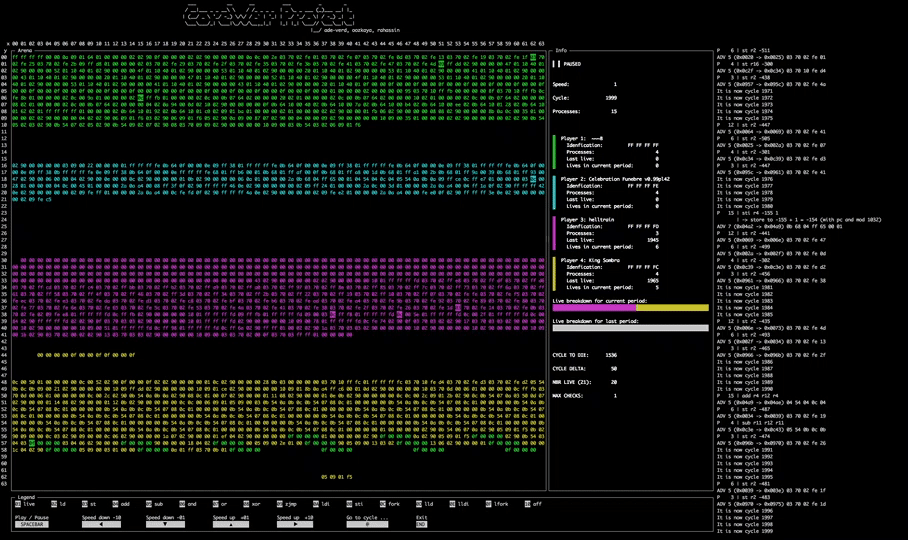
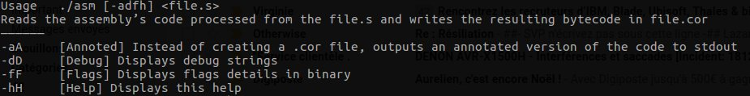
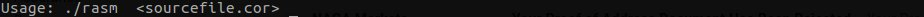

Corewar
======

About
-----

>Core War is a 1984 programming game created by D. G. Jones and A. K. Dewdney in which two or more battle programs (called "warriors") compete for control of a virtual computer.
These battle programs are written in an abstract assembly language called Redcode.

42 Version
----------

Here's how it looks like:

We don't use the same set of assembly instructions as the original Corewar and we have some modulo limitations for the read and write ranges.

Subjects: [corewar.fr.pdf](subject/corewar.fr.pdf) or [corewar.en.pdf](subject/corewar.en.pdf)

##### How to use it ?

* First you'll need to write a .s file with a set of assembly instructions
    * You can create your own champion with [this set below](#assembler-instructions)
    * Or you can just use one of the many warriors in the resources/champs directory
* Then you'll have to compile it using the `asm` binary
* Then just execute the `corewar` binary with your warrior(s) as arguments

>This was the final project of the Algorithm branch.

## Assembler instructions
--------

| Mnemonic | Effects (in French) |
|:--------:| ------------------- |
|0x01 (live)|Suivie de 4 octets qui représente le numéro du joueur. Cette instruction indique que ce joueur est en vie. Pas d’octet de codage des paramètres.|
|0x02 (ld)|Cette instruction prend 2 paramètres. Le deuxième est forcément un registre (pas le PC). Elle load la valeur du premier paramètre dans le registre. Cette opération modifie le carry. ``ld 34,r3`` charge les `REG_SIZE` octets a partir de l’adresse `(PC + (34 % IDX_MOD))` dans le registre r3.|
|0x03 (st)|Cette instruction prend 2 paramètres. Elle store (`REG_SIZE` octets) la valeur du premier argument (toujours un registre) dans le second. `st r4,34` store la valeur de r4 a l’adresse`(PC + (34 % IDX_MOD))`, `st r3,r8` copie r3 dans r8|
|0x04 (add)|Cette instruction prend 3 registres en paramètre, additionne le contenu des 2 premiers et met le résultat dans le troisième. Cette opération modifie le carry. `add r2,r3,r5` additionne r2 et r3 et mets le résultat dans r5|
|0x05 (sub)|Même que add mais soustrait|
|0x06 (and)|p1 & p2 -> p3 le paramètre 3 et toujours un registre. Cette opération modifie le carry. `and r2,%0,r3` met r2 & 0 dans r3|
|0x07 (or)|Même que and mais avec le ou (&#124; binaire).|
|0x08 (xor)|Même que and mais avec le ou exclusif (^ binaire).|
|0x09 (zjmp)|Cette instruction n’est pas suivie d’octet pour décrire les paramètres. Elle prend toujours un index (`IND_SIZE`) et fait un saut a cet index si le carry est à un. Si le carry est nul, zjmp ne fait rien mais consomme le même temps. `zjmp %23` met si carry == 1 met `(PC + (23 % IDX_MOD))` dans le PC.|
|0x0A (ldi)|Cette opération modifie le carry. `ldi 3,%4,r1` lit `IND_SIZE` octets à l’adresse : `(PC + (3 % IDX_MOD))` ajoute 4 à cette valeur. On nommera S cette somme. On lit `REG_SIZE` octets a l’adresse `(PC + (S % IDX_MOD))` qu’on copie dans r1. Les paramètre 1 et 2 sont des index.|
|0x0B (sti)|`sti r2,%4,%5` sti copie `REG_SIZE` octets de r2 a l’adresse `(4 + 5)`. Les paramètres 2 et 3 sont des index. Si les paramètres 2 ou 3 sont des registres, on utilisera leur contenu comme un index.|
|0x0C (fork)|Cette instruction n’est pas suivie d’octet pour décrire les paramètres. Elle prend toujours un index et crée un nouveau programme qui s’exécute a partir de l’adresse:`(PC + (premier paramètre % IDX_MOD))` `fork %34` crée un nouveau programme. Le nouveau programme hérite des différents états du père.|
|0x0D (lld)|Comme ld sans le `%IDX_MOD` Cette opération modifie le carry.|
|0x0E (lldi)|Comme ldi sans le `%IDX_MOD` Cette opération modifie le carry.|
|0x0F (lfork)|Comme fork sans le `%IDX_MOD` Cette opération modifie le carry.|
|0x10 (aff)|Cette instruction est suivi d’un octet de paramétrage pour décrire les paramètres. Elle prend en paramètre un registre et affiche le caractère dont le code ascii est présent dans ce registre. (un modulo 256 est applique au code ascii, le caractère est affiché sur la sortie standard). Ex :` ld %42,r3` puis `aff r3` affiche ’*’ sur la sortie standard.|

## Set up
------------

Just run `make`... then enjoy!

Works on OS X and Linux Debian / Ubuntu. The `nCurses` library is used for the viewer.

## Usage
-----

#### corewar - Virtual Machine
`./corewar [-hcvdD [cycle nb]] ([-n nb] file.cor) ...`

You can combine some flags. For example the flags -c (nCurses) and -v (Verbose)

##### Keys
* <kbd>spacebar</kbd> Play / Pause
* <kbd>▲</kbd> or <kbd>▶</kbd> Speed up (respectively +1 or +10)
* <kbd>▼</kbd> or <kbd>◀</kbd> Speed down (respectively -1 or -10)
* <kbd>@</kbd> Go to cycle ... Then an integer superior than the current cycle is expected. Validate with <kbd>Enter</kbd>
* <kbd>end</kbd> Quit properly the program

#### asm - Assembler
`./asm [-adfh] file.s`

#### rasm - Disassembler
`./rasm file.cor ...`

